# Trade quantity estimation
## Background
International Merchandise Trade Statistics often suffer from poor quantity values. One of the main reasons is that recording quantity information is not given the same importance as recording trade values. The main source of trade data is customs. Since duties are determined based on the trade values and not quantities, there's often little incentive of recording them diligently.

This leaves the statisticians with less than perfect data since many analyses require quantities and/or unit values. Accurate quantity information is of great interest to the statisticians and policy makers.

## Objective
The objective of the joint UNSD-ITC-FAO project is to detect outliers in trade quantities and estimate missing/outliers values.

## Data set
As a test case, tariffline annual data on rice imports by Mozambique between the years 2000 and 2019 are used.

## Tools
The volume of trade statistics necessitates use of cloud computing. For this project Azure databricks was used. The code was written in Python (PySpark).

## Algorithm
Below are the main steps in the algorithm:
- To impute missing values in the initial round, Standard Unit Values (SUVs) downloaded from UN Comtrade is used. These SUVs are global (all reporters, all partners) median for a commodity.
- A Z-test is conducted to detect outliers.
- Estimation (method TBD) is used to impute missing and outlier quantity values.

Below is a detailed description of the algorithm:   

**Extract data**   
Mozambique rice imports annual data (df) for all partners between 2000-2019. Since the data is more detailed than published, Reporter and Partner codes has been masked because of confidentiality.

```
df = sqlContext.sql("select reporterCode, partnerCode, period, cmdCode, primaryValue, netWgt, qtyUnitCode, altQtyUnitCode, altQty from delta.dtarifflineannual where reporterCode = '508' and flowCode = 'M' and cmdCode like '100630%' and period BETWEEN 2000 AND 2019")
```
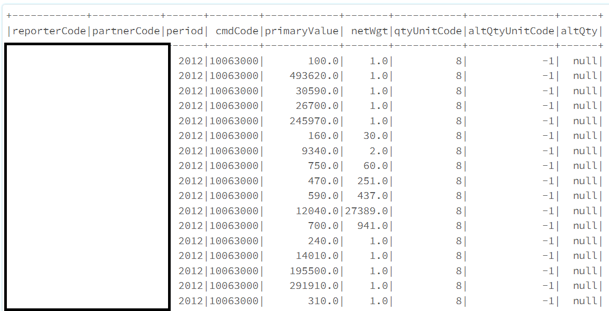

This dataset is then converted to a pandas dataframe for further analyses.   

**Import SUV**   
In the initial round, missing quantities are imputed using the Statndard Unit Values (SUV) table downloaded from COMTRADE <https://unstats.un.org/unsd/trade/data/tables.asp#SUV>.   
The table was previously uploaded to databricks Filestore which are then extracted.

```
SUV = pd.read_csv("/dbfs/FileStore/tables/TSUV_tabDelimUtf.txt", sep="\t")

#Subset the SUV table to keep only imports(flow_code=M) of rice(commodity_group_code=100630)
SUV = SUV[(SUV.trade_flow=="M") & (SUV.commodity_group_code==100630)]
```
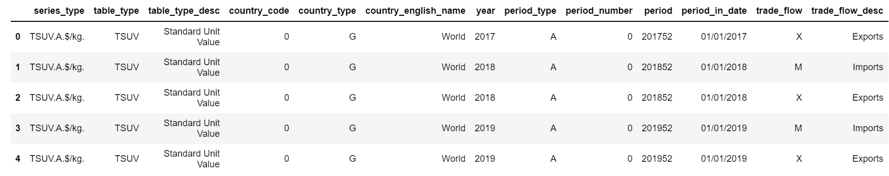

**Keep SUVs for only latest HS version**    
Only necessary columns in SUV are kept and prefix H from commodity classification version is dropped. The version number is then used to sort and remove duplicates keeping only the latest version.

```
SUV = SUV[['year', 'commodity_group_code', 'commodity_classification', 'value']]
SUV['commodity_classification'] = SUV['commodity_classification'].str[1:2]

#Now let's sort on year, commodity code and classification version, and then drop duplicates based on year and commodity by keeping last record. This will make sure that the record with the latest classification version remains.
SUV = SUV.sort_values(by=['year', 'commodity_group_code', 'commodity_classification'])
SUV = SUV.drop_duplicates(subset = ['year', 'commodity_group_code'], keep = 'last')
```
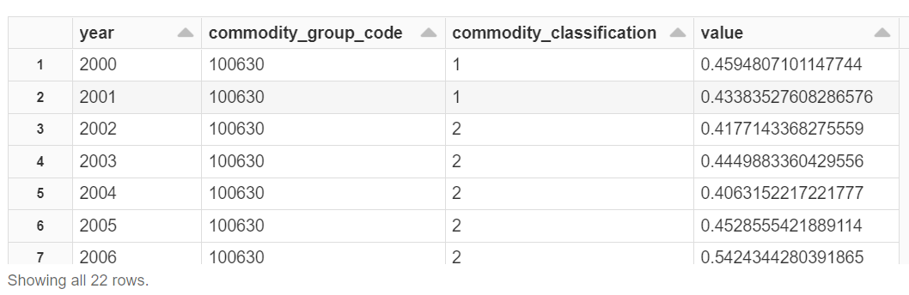

**Merge df with SUV**   
SUV is merged with df by year and commodity code. We need to rename SUV's year column as period and create a column in df with 6-digits commodity codes named as commodity_group_code. This ensures that the two dataframes have two columns each with same titles to merge on. Also, renaming the SUV column from value to SUV to avoid confusion with primaryValue in df

```
SUV.rename(columns = {'year':'period',
                     'value': 'SUV'},
           inplace = True)
SUV['commodity_group_code'] = SUV['commodity_group_code'].astype(str)
df['commodity_group_code'] = df['cmdCode'].str[:6]
df = pd.merge(df, SUV, how='left')
```
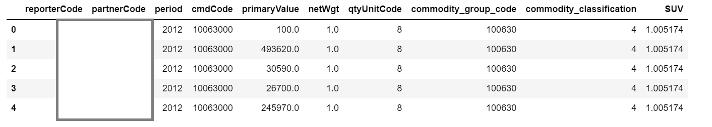

**Estimate missing netweights**   
If netWgt is null, it will be estimated as primaryValue/value (SUV). But before that, create a flag variable which will be 1 if net weight is estimated, 0 otherwise. Next, if qtyUnitCode is -1, force it to 8.

```
df['flag'] = np.where(df['netWgt'].isnull(), 1, 0)
df['netWgt_complete'] = np.where(df['netWgt'].isnull(), (df['primaryValue']/df['SUV']), df['netWgt'])
df['qtyUnitCode'] = pd.to_numeric(df['qtyUnitCode'])
df['qtyUnitCode_complete'] = np.where((df['qtyUnitCode']==-1), 8, df['qtyUnitCode'])
```

**Calulate ratio of available records**   
For the Z-test, we need to find out the ratio of periods during which a partner-commodity combination has records to total number of periods. So we create a table to count the occurence of all partner-commodity-period combinations.

```
count_series = df.groupby(['partnerCode', 'commodity_group_code', 'period']).size()
freq_df = count_series.to_frame(name = 'size').reset_index()
```

Many partners have multiple records per period. But we're interested in the ratio of number of periods for which records are available to total periods.

```
freq_df = freq_df.drop(['size'], axis = 1)
freq_df = freq_df.groupby(['partnerCode', 'commodity_group_code']).size()
freq_df = freq_df.to_frame(name = 'nperiod').reset_index()
```

Finally, calculate the ratio by dividing by total number of periods.

```
n = df['period'].nunique()
freq_df['share'] = freq_df['nperiod']/n
```


For this example, very few partners have records for more than 80% of the periods.

```
freq_df.hist(column="share", bins=5, grid=False, rwidth=.97)
```
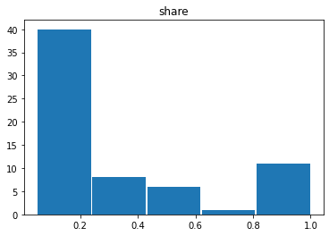

But these partners account for majority of values.

```
group1 = freq_df[freq_df["share"]>=0.8]["partnerCode"]
group2 = freq_df[freq_df["share"]<0.8]["partnerCode"]

sum1 = df[df["partnerCode"].isin(group1)]["primaryValue"].sum()
sum2 = df[df["partnerCode"].isin(group2)]["primaryValue"].sum()

pie_df = pd.DataFrame({'partner_group': ["more_than_80%", "less_than_80%"],
                   'sum_values': [sum1, sum2]})

pie_df.plot(kind='pie', y='sum_values')
```
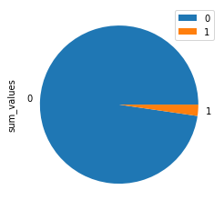

**Calculate new variables for Z score**   
In first step, calculate:
- Log of primaryValue (logV)
- Unit values (UV)
- Log of unit values (logUV)
- Log of quantity (logQty)

```
df["logV"] = np.log(df["primaryValue"])
df["UV"] = df["primaryValue"]/df["netWgt_complete"]
df["logUV"] = np.log(df["UV"])
df["logQty"] = np.log(df["netWgt_complete"])
```

Next, for each reporter, partner and commodity combination, calculate mean of:
- primaryValue
- logV
- UV
- logUV
- netWgt_complete
- logQty

```
df_mean = df.groupby(["reporterCode", "partnerCode", "commodity_group_code"]).agg({'primaryValue':'mean',
     'logV':'mean',
    'UV':'mean',
    'logUV':'mean',
    'netWgt_complete':'mean',
    'logQty':'mean',
    }).reset_index()
```

Then merge the dataframe of reporter-partner-commodity specific means (df_mean) with the main dataframe. We need to rename some columns first.

```
df_mean.rename(columns = {'primaryValue':'meanV',
                          'logV':'meanlogV',
                          'UV':'meanUV',
                          'logUV':'meanlogUV',
                          'netWgt_complete':'meanQty',
                          'logQty':'meanlogQty'},
               inplace = True)

df = pd.merge(df, df_mean, how='left')
```

Next, we calculate more Z-test variables:
- primaryValue - mean value = diffV
- absolute primaryValue - mean value = ABSdiffV
- logV - mean logV = difflogV
- absolute logV - mean logV = ABSdifflogV
- UV - mean UV = diffUV
- absolute UV - mean UV = ABSdiffUV
- logUV - mean logUV = difflogUV
- absolute logUV - mean logUV = ABSdifflogUV
- netWgt_complete - meanQty = diffQty
- absolute netWgt_complete - meanQty = ABSdiffQty
- logQty - mean logQty = difflogQty
- absolute logQty - mean logQty = ABSdifflogQty

```
df['diffV'] = df['primaryValue'] - df['meanV']
df['ABSdiffV'] = abs(df['diffV'])

df['difflogV'] = df['logV'] - df['meanlogV']
df['ABSdifflogV'] = abs(df['difflogV'])

df['diffUV'] = df['UV'] - df['meanUV']
df['ABSdiffUV'] = abs(df['diffUV'])

df['difflogUV'] = df['logUV'] - df['meanlogUV']
df['ABSdifflogUV'] = abs(df['difflogUV'])

df['diffQty'] = df['netWgt_complete'] - df['meanQty']
df['ABSdiffQty'] = abs(df['diffQty'])

df['difflogQty'] = df['logQty'] - df['meanlogQty']
df['ABSdifflogQty'] = abs(df['difflogQty'])
```

The resulting data at this point looks as below (since there were too many variables, a few screenshots were needed):

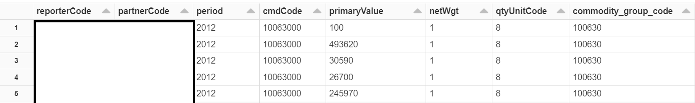
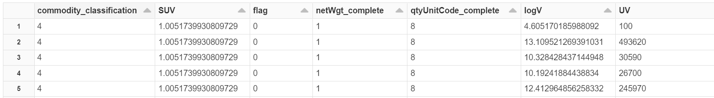
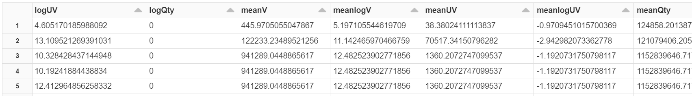
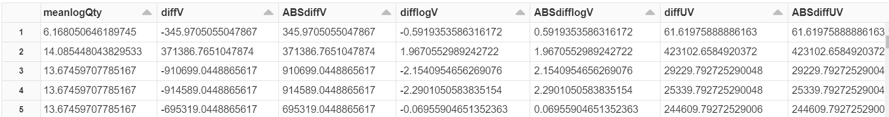
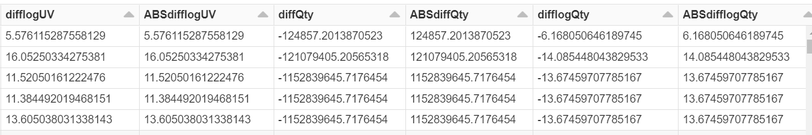
